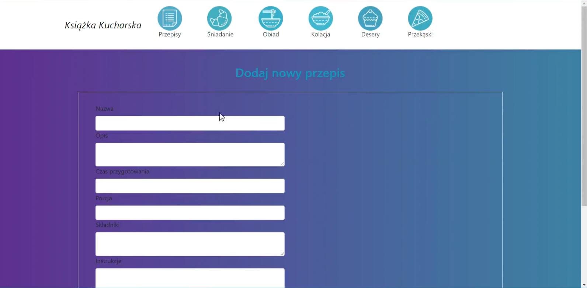

# ASP.NET Core app with Razor Pages
ASP.NET Core web application with Razor Pages.  
Project created for university classes.  
>App developed: May 2020

## Table of Contents
* [General Info](#general-information)
* [Technologies Used](#technologies-used)
* [Features](#features)
* [Screenshots](#screenshots)
* [Project Status](#project-status)

## General Information
Web application for storing culinary recipes.  
Project developed for university classes, with focus on learning and practice of developing web applications using ASP.NET Core and Razor Pages.  
Application data was stored in a local MS SQL database.  

## Technologies Used
- ASP.NET Core - version 3.1
- MS SQL Server

## Features
App features:
- Adding new recipes
- Editing recipes
- Deleting recipes
- Displaying all available in app recipes
- Displaying recipes in their respective category page

## Screenshots

Home page:

Displaying all availables recipes:

Recipes example - recipes for breakfast:

Recipes example - recipes for dinner:

Recipe editing:

Adding new recipe:

## Project Status
Project is: _complete_  
Currently project is completed. All planned features have been implemented.   
Project was developed in May 2020.  
Project developed for practice as fist web application in ASP.NET Core.  
In plans recreating this project more properly and with some additional features as ASP.NET MVC web applications.
